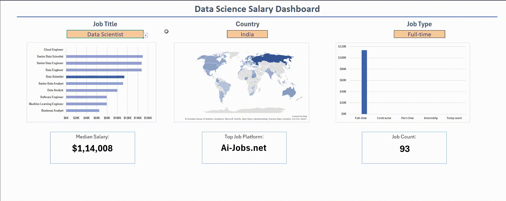
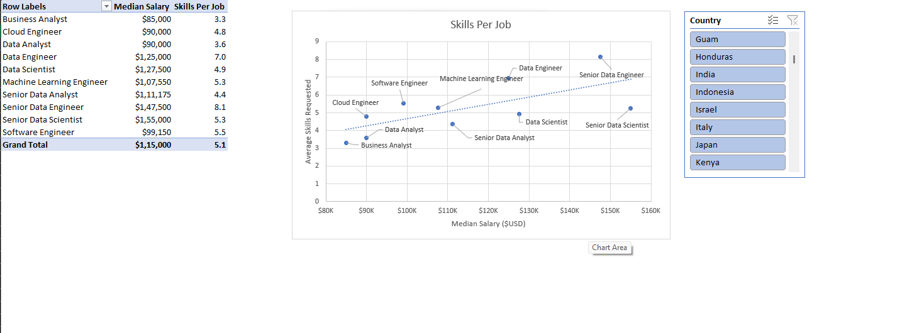

# Data Science Salary Analysis — Excel

Exploring **1,000+ real-world data science job postings** to uncover salary trends across roles, countries, and skills — built entirely in Excel.

---

## 🔑 Key Findings

- **Senior Data Scientists** earn the highest median salary at **$155,000**, nearly double a Business Analyst's $85,000
- **US roles pay up to 49% more** than non-US equivalents — most stark for Machine Learning Engineers ($150k US vs $101k non-US)
- **SQL** is required in **52% of all job postings**, making it the most in-demand skill — but **Python pays the most** at $98,500 median
- **More skills = higher pay** — Senior Data Engineers average 8.1 skills per posting and earn $147,500; Business Analysts average 3.3 and earn $85,000

---

## 📊 Projects

| | Project | Description | Tools |
|-|---------|-------------|-------|
| 📊 | [Dashboard](./Dashboard) | Interactive 3-panel dashboard — filter by job title, country & job type to see median salary, top platform, and job count | Data Validation, MEDIAN/IF, Bing Maps |
| 📈 | [Analysis](./Analysis) | Four-part salary analysis — role vs pay, US vs non-US, skill demand vs salary, skills per job | Power Query, Power Pivot, DAX |

---

## 🗂️ Dataset

1,000+ job postings scraped from LinkedIn, Indeed, ZipRecruiter, and Ai-Jobs.net — covering 10 job titles across 100+ countries, with salary, skills, and employment type data.

---

## 🙏 Acknowledgements

Project inspired by and built following [Luke Barousse's Excel for Data Analytics course](https://youtu.be/pCJ15nGFgVg?si=u0hz_Q-PPEXmhH5f) on YouTube.